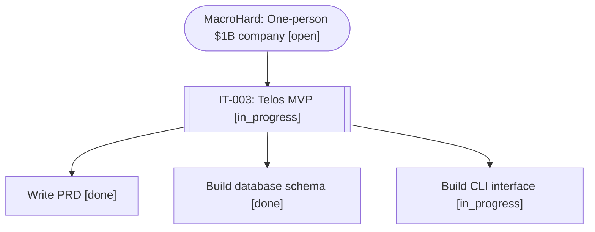

# Telos — Usage Examples

## Example 1: MacroHard Goal Tree

### Initialize and set up root goal

```bash
cd it003-telos
node src/cli.js init
```

### Add top-level goal

```bash
node src/cli.js add "MacroHard: One-person $1B company" \
  --type goal \
  --value 1000000000 \
  --owner andreas \
  --description "Build the infrastructure for a one-person billion-dollar company"
```

### Add IT-003 milestone

```bash
node src/cli.js add "IT-003: Telos MVP" \
  --parent 1 \
  --type milestone \
  --value 50000 \
  --cost 10000 \
  --budget 15000 \
  --effort 18 \
  --owner atlas \
  --description "Build Telos: hierarchical work management system" \
  --success-criteria "CLI working, browser viz functional, empirical learning active"
```

### Break down into tasks

```bash
node src/cli.js add "Write PRD" \
  --parent 2 \
  --type task \
  --value 10000 \
  --cost 1000 \
  --effort 2 \
  --owner atlas \
  --success-criteria "PRD.md written and approved"

node src/cli.js add "Build database schema" \
  --parent 2 \
  --type task \
  --value 15000 \
  --cost 2000 \
  --effort 3 \
  --owner atlas \
  --success-criteria "schema.sql created, tables + views + triggers working"

node src/cli.js add "Build CLI interface" \
  --parent 2 \
  --type task \
  --value 15000 \
  --cost 3000 \
  --effort 5 \
  --owner atlas \
  --success-criteria "All CRUD commands working, queries functional"

node src/cli.js add "Build browser visualization" \
  --parent 2 \
  --type task \
  --value 20000 \
  --cost 4000 \
  --effort 6 \
  --owner atlas \
  --success-criteria "D3.js tree view with status colors, tooltips, expand/collapse"

node src/cli.js add "Test and document" \
  --parent 2 \
  --type task \
  --value 5000 \
  --cost 1000 \
  --effort 2 \
  --owner atlas \
  --success-criteria "README complete, sample data tested, examples documented"
```

---

## Example 2: Working a Task

### View next best actions

```bash
node src/cli.js next --limit 5
```

**Output:**
```
🎯 Next Best Actions:

┌─────────┬──────────────────────────────┬────────────┬───────┬────────┬──────┬──────┬────────┐
│ (index) │ Title                        │ Parent     │ Owner │ Value  │ Cost │ ROI  │ Effort │
├─────────┼──────────────────────────────┼────────────┼───────┼────────┼──────┼──────┼────────┤
│ 0       │ 'Build browser visualization'│ 'IT-003..'│ atlas │ 20000  │ 4000 │ 4.76 │ 6      │
│ 1       │ 'Build CLI interface'        │ 'IT-003..'│ atlas │ 15000  │ 3000 │ 4.76 │ 5      │
│ 2       │ 'Build database schema'      │ 'IT-003..'│ atlas │ 15000  │ 2000 │ 7.14 │ 3      │
└─────────┴──────────────────────────────┴────────────┴───────┴────────┴──────┴──────┴────────┘
```

### Start work

```bash
node src/cli.js start 4
# ✅ Started work on node: 4
```

### Check status

```bash
node src/cli.js show 4
```

**Output:**
```
━━━ Node Details ━━━
ID: 4
Title: Build database schema
Type: task
Owner: atlas
Status: in_progress
Parent ID: 2

━━━ Value Model ━━━
Value: 15000
Cost estimate: 2000
Cost actual: N/A
Risk: 0
ROI: 7.14
Budget: N/A

━━━ Time Tracking ━━━
Effort estimate: 3 hours
Effort actual: N/A hours
Created: 2/18/2026, 6:30:00 PM
Started: 2/18/2026, 6:35:00 PM
Completed: N/A

━━━ Children ━━━
Total children: 0
Children done: 0
Has incomplete children: No

━━━ Success Criteria ━━━
schema.sql created, tables + views + triggers working
```

### Complete work

```bash
node src/cli.js complete 4 --cost-actual 1800 --effort-actual 2.5
# ✅ Completed node: 4
```

---

## Example 3: Blocking and Refusing

### Block a task

```bash
node src/cli.js block 5 --reason "Waiting for database schema to be finalized"
# 🚫 Blocked node: 5
```

### Refuse a task

```bash
node src/cli.js refuse 10 --reason "Out of scope for MVP, deferring to v0.2"
# ❌ Refused node: 10
```

---

## Example 4: Reporting

### Bottleneck report

```bash
node src/cli.js bottlenecks
```

**Output:**
```
🚧 Bottlenecks:

┌─────────┬────────────────────────┬──────────────┬────────────────────┬────────────────┬──────────────────────┐
│ (index) │ Parent                 │ Status       │ Blocked Children   │ Blocked Value  │ Downstream Value     │
├─────────┼────────────────────────┼──────────────┼────────────────────┼────────────────┼──────────────────────┤
│ 0       │ 'IT-003: Telos MVP'   │ in_progress  │ 3                  │ 40000          │ 50000                │
└─────────┴────────────────────────┴──────────────┴────────────────────┴────────────────┴──────────────────────┘
```

### Workload report

```bash
node src/cli.js workload
```

**Output:**
```
💼 Workload:

┌─────────┬────────┬──────────────┬──────────────┬──────────────┐
│ (index) │ Owner  │ Active Tasks │ Total Hours  │ Total Value  │
├─────────┼────────┼──────────────┼──────────────┼──────────────┤
│ 0       │ atlas  │ 3            │ 14           │ 50000        │
└─────────┴────────┴──────────────┴──────────────┴──────────────┘
```

### Estimation accuracy

```bash
node src/cli.js accuracy
```

**Output:**
```
📊 Estimation Accuracy:

Completed tasks: 2

Cost Estimates:
  MAE (Mean Absolute Error): 150.00
  MAPE (Mean Absolute % Error): 8.3%

Effort Estimates:
  MAE (Mean Absolute Error): 0.25
  MAPE (Mean Absolute % Error): 10.0%
```

---

## Example 5: Visualization

### Export for browser

```bash
node src/cli.js viz
# ✅ Exported to: web/telos-data.json
# 💡 Open web/index.html in a browser to visualize
```

### Open in browser

```bash
open web/index.html
# Or: firefox web/index.html
# Or: google-chrome web/index.html
```

**Features:**
- Interactive tree with pan and zoom
- Color-coded status (green=done, blue=in_progress, yellow=open, red=blocked)
- Hover for node details (value, cost, ROI, effort)
- Click to expand/collapse branches
- Reset view / Expand all / Collapse all buttons

### Export to Mermaid

```bash
node src/cli.js viz --format mermaid --output tree.mmd
cat tree.mmd
```

**Output:**


### Export to GraphViz

```bash
node src/cli.js viz --format dot --output tree.dot
dot -Tpng tree.dot -o tree.png
open tree.png
```

---

## Example 6: Querying and Filtering

### List all open tasks

```bash
node src/cli.js list --status open
```

### List atlas's tasks

```bash
node src/cli.js list --owner atlas
```

### List only goals

```bash
node src/cli.js list --type goal
```

### List children of a node

```bash
node src/cli.js list --parent 2
```

### Sort by value

```bash
node src/cli.js list --sort value --limit 10
```

---

## Example 7: Budget Management

### Add node with budget

```bash
node src/cli.js add "Build API integration" \
  --parent 2 \
  --type task \
  --value 25000 \
  --cost 5000 \
  --budget 7000 \
  --owner atlas
```

### Check budget status

```bash
node src/cli.js show 8
# Budget: 7000
# Cost estimate: 5000
# Cost actual: N/A
```

### Complete with actual cost exceeding budget

```bash
node src/cli.js complete 8 --cost-actual 7500
# Node automatically transitions to out_of_budget status
```

### Verify status

```bash
node src/cli.js show 8
# Status: out_of_budget
```

---

## Example 8: Continuous Learning

### Complete multiple tasks with actuals

```bash
node src/cli.js complete 3 --cost-actual 950 --effort-actual 1.8
node src/cli.js complete 4 --cost-actual 1800 --effort-actual 2.5
node src/cli.js complete 5 --cost-actual 3200 --effort-actual 5.2
```

### Check estimation accuracy

```bash
node src/cli.js accuracy
```

**Interpretation:**
- **MAE (Mean Absolute Error)**: Average difference between estimate and actual
- **MAPE (Mean Absolute Percentage Error)**: Average % difference

**Goal:** MAPE < 20% indicates good estimation accuracy

---

## Example 9: Real-World Workflow

### Morning: Plan the day

```bash
# Check next best actions
node src/cli.js next --limit 5

# Check workload
node src/cli.js workload

# Pick highest ROI task
node src/cli.js start 6
```

### During work: Update status

```bash
# Hit a blocker
node src/cli.js block 6 --reason "Need API credentials from Andreas"

# Switch to next best action
node src/cli.js next --limit 1
node src/cli.js start 7
```

### End of day: Record actuals

```bash
# Complete finished tasks
node src/cli.js complete 7 --cost-actual 2800 --effort-actual 4.5

# Check progress
node src/cli.js bottlenecks
node src/cli.js accuracy
```

### Weekly: Visualize and review

```bash
# Export visualization
node src/cli.js viz
open web/index.html

# Review status summary
node src/cli.js list --status done
node src/cli.js list --status blocked
```

---

## Tips & Best Practices

1. **Set realistic estimates**: Start conservative, learn from actuals
2. **Track budget closely**: Kill underperforming branches early
3. **Review bottlenecks daily**: Unblock high-value parents first
4. **Use ROI for prioritization**: Always work on highest ROI when possible
5. **Document success criteria**: Clear definition of done prevents scope creep
6. **Complete with actuals**: Feed the learning loop for better future estimates
7. **Visualize regularly**: Tree view helps spot structural issues
8. **Refuse low-value work**: Don't be afraid to kill bad ideas

---

## Troubleshooting

### Database locked error

```bash
# Close any open connections
# Delete lock file if exists
rm telos.db-shm telos.db-wal
```

### Visualization not loading

```bash
# Ensure data is exported
node src/cli.js viz

# Check that telos-data.json exists
ls -la web/telos-data.json

# Serve with local HTTP server if needed
cd web && python3 -m http.server 8000
# Open http://localhost:8000
```

### Node not found

```bash
# List all nodes to find the right ID
node src/cli.js list

# Show specific node
node src/cli.js show <id>
```

---

**More help:** See README.md or PRD.md
